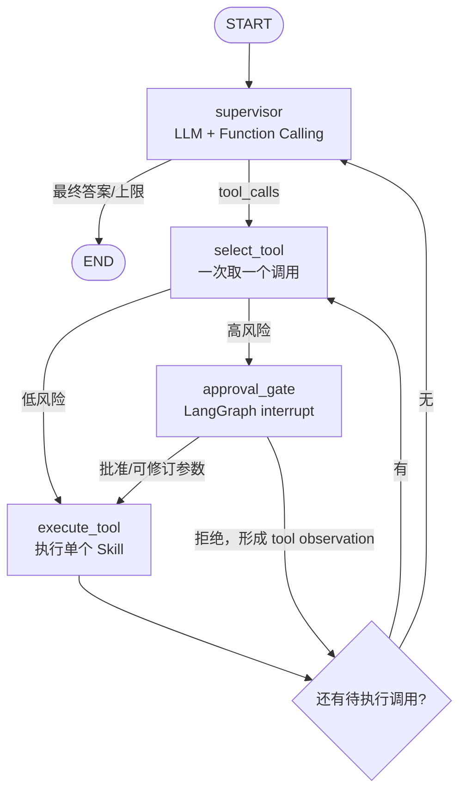
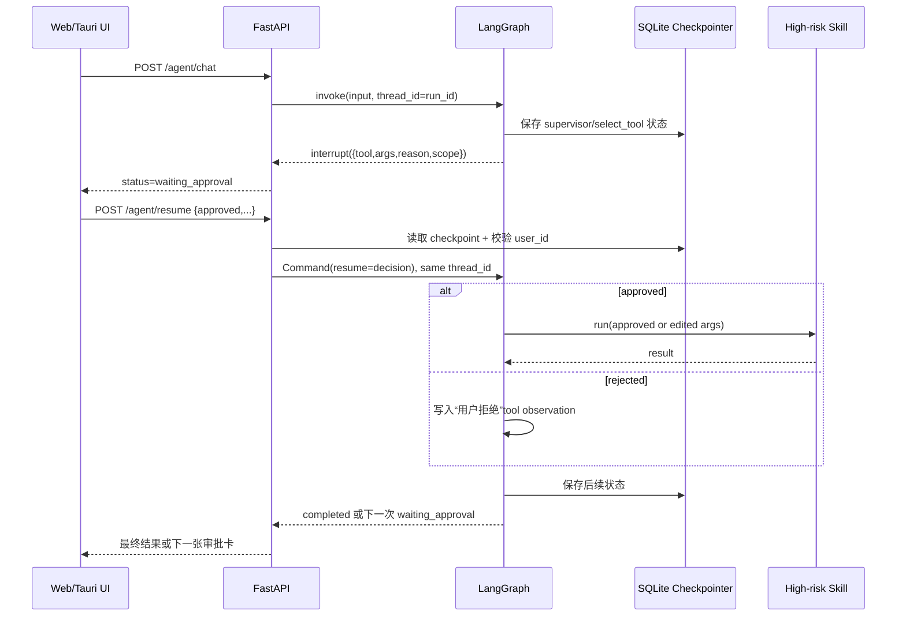

# DocMind v3.0.0 LangGraph 实施与发布说明

发布日期：2026-07-20

## 1. 本版目标与明确边界

v3.0.0 将 **外层 Agent 编排**从手写 ReAct `for` 循环迁移到 LangGraph，并交付三项
可验证能力：

1. 每轮 LLM 决策、工具选择、审批和执行都有明确图节点；
2. 高风险外层 Skill 在产生副作用前通过 `interrupt()` 暂停，等待当前用户审批；
3. 状态写入 SQLite checkpointer，服务或桌面 App 重启后可用同一 `thread_id` 恢复。

本版**没有**把 Generic Skill 内部 ReAct runner 改写为子图，也没有把 Supervisor 拆成
多个专业 Agent。Generic Skill 只要声明 `package_scripts`、`mcp`、`browser`、`app` 或
`repository` 等高风险能力，会在进入整个 package 前审批；这不是内部每一步动作审批。
这种边界是有意保留的，避免在没有解决 adapter session、动作幂等和子图状态契约前做
“看似全面、实际不可恢复”的迁移。

## 2. 外层状态图



关键实现位于 `app/agent/orchestrator.py`：

- `AgentState` 只包含 JSON/消息/列表等可序列化数据，不把 LLM client、数据库 Session、
  Skill executor 或 adapter session 放入 checkpoint；
- `supervisor` 只做模型决策，不执行工具副作用；
- `execute_tool` 一次只执行一个 Skill。节点完成后 LangGraph 先写 checkpoint，再进入下一步；
- `approval_gate` 在 `interrupt()` 之前不执行工具，所以恢复时该节点从头运行不会重复副作用；
- `execute_tool` 使用 `run_id + supervisor 轮次 + provider tool_call_id` 回执：已完成结果可在节点重放时直接复用；
  只留下 `started` 的调用视为结果不确定，再次 interrupt，由人决定是否重试；
- 原有 `skill_name` 首轮强制调用、选定 `document_id` 时首轮 RAG、artifact 收集和
  base64 不回填 LLM 的契约均保留。

## 3. 人工审批流程



审批策略来自两组配置：

- `AGENT_HIGH_RISK_SKILLS`：部署者显式列出的外层 Skill 名称；
- `AGENT_HIGH_RISK_CAPABILITIES`：Generic package 声明这些 capability 时，整个调用需审批。

Python-backed Skill 也可设置 `requires_approval = True`。审批者可以：

- `approved=true`：按原参数执行；
- `approved=true + edited_args`：按人工修订参数执行；
- `approved=false`：不执行 Skill，并把拒绝作为 tool observation 交回 Supervisor；
- 通过 `comment` 留下本次决策说明，调用轨迹会保存审批结果。

## 4. Checkpoint 与恢复

### 4.1 存储位置

- Web 默认：`./data/agent-checkpoints.sqlite3`；
- 桌面：sidecar 强制覆盖为用户应用数据目录下的 `agent-checkpoints.sqlite3`；
- `run_id` 与 LangGraph `thread_id` 相同。v3 前端在请求前用 `crypto.randomUUID()` 生成并保存；
  其他客户端可传自己的不可预测随机 ID，未传时服务端生成。相同 ID 的顺序 HTTP 重试直接
  返回已有 checkpoint，不创建第二个会话或重复执行；底层 `run_agent()` 拒绝覆盖已有 ID。

SQLite 使用 WAL、`busy_timeout` 和独立连接。`resume_agent()` 每次重新打开 saver 并重新
compile graph，因此恢复不依赖原 Python graph 对象仍在内存中。

### 4.2 所有权和消息落库

checkpoint state 保存 `user_id` 与 `conversation_id`。状态查询和恢复都先校验当前 JWT 用户；
“不存在”和“属于其他用户”统一返回 404，避免泄漏有效 run ID。

首次 `/agent/chat` 即使暂停也会保存用户消息，但不会伪造 Assistant 完成消息。只有图进入
`completed` 后才落库 Assistant 回复和 trace；trace envelope 同时保存 `agent_run_id` 作为
幂等标识。若图已完成、进程却在业务事务提交前退出，相同 run 的重试会补写缺失回复；已提交
的回复不会再插入一次。若恢复过程中再次遇到高风险调用，会返回新的 `waiting_approval`，仍
沿用同一 run。

### 4.3 API

开始执行：

```http
POST /agent/chat
Authorization: Bearer <token>
Content-Type: application/json

{"message":"执行需要仓库权限的技能","skill_name":"some_skill","run_id":"客户端随机 UUID"}
```

暂停响应在原 `conversation_id / answer / artifacts / trace` 上增加：

```json
{
  "run_id": "f4...",
  "thread_id": "f4...",
  "status": "waiting_approval",
  "approval": {
    "kind": "tool_approval",
    "scope": "outer_skill",
    "tool": "some_skill",
    "args": {"task": "..."},
    "risk_capabilities": ["repository"],
    "reason": "该 Generic Skill 在本次调用中可能使用高风险宿主能力：repository"
  }
}
```

审批并恢复：

```http
POST /agent/resume
Authorization: Bearer <token>
Content-Type: application/json

{
  "run_id": "f4...",
  "approved": true,
  "comment": "仅批准本次操作",
  "edited_args": null
}
```

刷新或重启页面后读取状态：

```http
GET /agent/runs/{run_id}
Authorization: Bearer <token>
```

若返回 `status=running, recoverable=true`，说明存在非 interrupt 的未完成节点：

```http
POST /agent/runs/{run_id}/recover
Authorization: Bearer <token>
```

恢复时若工具回执已是 `completed`，直接复用结果；若只记录到 `started`，会返回新的
`waiting_approval`，说明上次副作用结果不确定，必须人工决定是否重试。

## 5. 升级与部署

1. 备份应用数据库和用户数据目录；本版没有新增 Alembic revision。
2. 安装新增依赖：

   ```bash
   uv pip install -r requirements.txt
   ```

3. 检查 `AGENT_CHECKPOINT_PATH` 的父目录可写，且不要把 checkpoint 文件放进 Git、只读
   镜像层或多个不共享磁盘的实例。
4. 按最小权限配置 `AGENT_HIGH_RISK_SKILLS` 与 `AGENT_HIGH_RISK_CAPABILITIES`。
5. 启动后验证普通 Skill、等待审批、拒绝、批准、进程重启后批准五条路径。

桌面安装包由 signed sidecar 自动选择 checkpoint 路径，不应让旧 `desktop.env` 把它指回
应用 bundle 或开发目录。

## 6. 验证命令

```bash
uv run pytest tests/test_langgraph_agent.py tests/test_agent_api.py
uv run pytest --cov=app --cov-report=term-missing

cd frontend
npm run test:e2e -- e2e/core-flow.spec.js --project=chromium

cd ../desktop
npm run test:sidecar
npm run test:rust
```

发布结论以当前分支和 GitHub Actions 的实际输出为准，不在文档中固定测试数量或覆盖率快照。

## 7. 已知限制与下一阶段

### 7.1 v3.0.0 已知限制

- SQLite checkpointer 适合当前单机 Web/桌面形态。多副本 Web 服务应迁移到共享的生产级
  checkpointer，并增加分布式 resume 并发租约；不要让多个容器各自写本地 SQLite 后声称可恢复。
- v3.0.0 没有分布式 run 租约。客户端应串行发送同一 `run_id` 的首次请求，并只在确认原执行
  已停止或进程已重启后调用 `recover`；它不是并发提交/并发恢复协调器。
- checkpoint 会保留图状态和 artifact。大文件 artifact 仍沿用现有 base64 API，长期运行需制定
  保留期和清理策略。
- 审批是当前登录用户对本次外层调用的确认，不是企业级多角色/四眼审批工作流。

### 7.2 后续迁移顺序

1. **Generic Skill 子图**：把 prepare → LLM → action selection → per-action approval →
   execute → observe → finalize 建成独立子图；持久化 adapter session 描述而不是客户端对象；
   为写文件、脚本、MCP/browser/app 分别定义幂等键与重放语义。
2. **生产 checkpointer**：Web 多副本切换共享后端，增加 checkpoint TTL、归档、清理和恢复审计。
3. **Multi-Agent**：在有评估证据后再拆 document/research/content 等专业 Agent；先定义共享
   state、handoff 和预算，再迁移，避免把多个 prompt 包装成“多 Agent”却没有隔离与验收。
4. **审批治理**：如业务需要，再增加审批角色、审计日志、过期、撤回和双人复核。

上述项目均未计入 v3.0.0 已完成功能。
