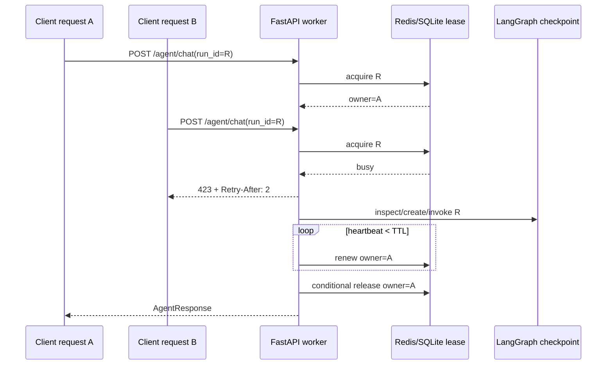
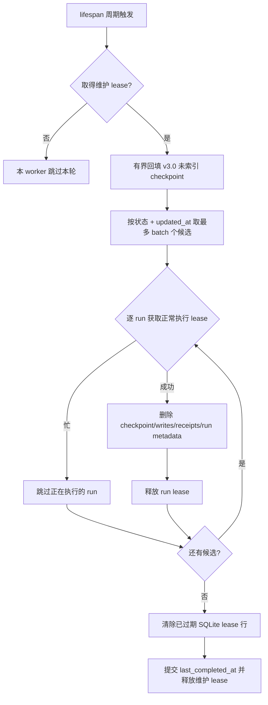

# DocMind v3.1.0 分布式运行锁与生命周期维护

> 发布日期：2026-07-20
>
> 适用范围：从 v3.0.0 升级到 v3.1.0；外层 LangGraph Agent 运行协调与 checkpoint 维护。
> 事实来源：`app/agent/run_lock.py`、`checkpoint_store.py`、`checkpoint_cleanup.py`、
> `app/services/agent_service.py`、`app/config.py` 及对应自动化测试。

## 1. 本版解决的问题

v3.0 已经能把外层 Agent 保存为 LangGraph checkpoint，并在人工审批或进程重启后恢复。
但“能够恢复”不等于“允许多个 worker 同时恢复”。如果两个进程同时推进同一个 `run_id`，
可能同时读取旧 checkpoint、重复调用工具，再互相覆盖后续状态。

v3.1 增加两类控制：

1. **运行租约**：任何会创建或推进 graph 的请求必须先独占同一 `run_id`；
2. **生命周期维护**：按状态和年龄分批删除不再需要的 checkpoint，避免 SQLite 无限增长。

本版没有改变 Generic Skill 内部 runner，也没有把整个 Agent 改成 Multi-Agent。

## 2. 为什么这里叫 lease，而不是无限期 mutex

普通互斥锁依赖持有进程主动释放。worker 被强制终止、机器断电或网络分区时，它可能永远无法
执行释放逻辑。因此 v3.1 使用带过期时间的 **lease（租约）**：

- 获取时写入随机 `owner_token` 和 `expires_at`；
- 持有者每隔 `heartbeat_seconds` 延长过期时间；
- 只有 token 仍匹配的持有者可以续租或释放；
- worker 消失后，TTL 到期，新 worker 可以接管；
- 旧 worker 晚到的 release 不能删除新 worker 的 lease。

这与 Redis 官方分布式锁文档中的“随机所有者值 + 有限有效期 + 条件删除”原则一致；Web 实现
直接复用 redis-py `Lock` 的 token 所有权和 Lua 条件操作，而不是自行拼接不安全的
`SETNX + DEL`。参考：<https://redis.io/docs/latest/develop/clients/patterns/distributed-locks/>、
<https://redis.readthedocs.io/en/stable/lock.html>。

## 3. 两种运行后端

| 运行形态 | `auto` 解析结果 | 互斥范围 | 是否新增终端依赖 |
|---|---|---|---|
| Web/Celery | Redis | 共享同一 Redis 与 namespace 的进程/主机 | 无；Web 本来就依赖 Redis/Celery |
| Desktop/local | SQLite | 共享同一 checkpoint 文件的进程 | 无；继续自包含 |
| 显式测试/诊断 | `off` | 无互斥 | 只能由部署者主动设置 |

桌面 sidecar 与 Rust 宿主都强制注入 `AGENT_RUN_LOCK_BACKEND=sqlite`。即使用户的旧
`desktop.env` 写了其他值，也不能把安装包悄悄改成依赖外部 Redis。

### 3.1 Redis 后端

`RedisLeaseBackend` 使用：

```text
key = <namespace>:<run_id>
blocking = false
timeout = AGENT_RUN_LOCK_TTL_SECONDS
thread_local = false
token = random owner token
```

心跳在线程中执行，因此必须关闭 redis-py 的 thread-local token 存储，让获取线程与心跳线程
共享同一 Lock 实例的 token。获取失败表示忙；连接或命令失败表示后端不可用；`reacquire()`
失败表示所有权已丢失。

### 3.2 SQLite 后端

SQLite lease 与 LangGraph checkpoint 使用同一文件，但使用 DocMind 自有表：

```sql
CREATE TABLE docmind_agent_run_leases (
    lock_key TEXT PRIMARY KEY,
    owner_token TEXT NOT NULL,
    expires_at REAL NOT NULL,
    updated_at REAL NOT NULL
);
```

获取、续租和释放使用 `BEGIN IMMEDIATE`，由 SQLite 的单写者事务保证比较与写入不可被另一个
进程插入。数据库启用 WAL、`synchronous=NORMAL` 和 30 秒 busy timeout。

SQLite 后端适合桌面或共享单机文件，不等于跨主机分布式数据库。不要把 checkpoint SQLite
放在不保证 SQLite 锁语义的网络文件系统后声称已经支持水平扩展。

## 4. 锁覆盖哪些入口

| API | 是否拿独占 run lease | 原因 |
|---|---:|---|
| `POST /agent/chat` | 是 | 客户端可重试同一 ID；检查旧 checkpoint、创建会话和首次 graph invoke 必须原子串行 |
| `POST /agent/resume` | 是 | 防止同一审批被两个 worker 同时恢复 |
| `POST /agent/runs/{run_id}/recover` | 是 | 防止两个崩溃恢复请求重复执行节点 |
| `GET /agent/runs/{run_id}` | 否 | 只读观察必须在执行期间保持可用 |

初次请求的 guard 位于幂等 checkpoint 检查之外，而不是只包住 `graph.invoke()`。否则两个并发请求
都可能先观察到“不存在”，再各自创建业务会话或执行首节点。



## 5. HTTP 故障语义

| 情况 | 状态码 | 客户端动作 |
|---|---:|---|
| 另一个 worker 正持有 run | `423 Locked` | 保留原 run ID，等待 `Retry-After` 后读取状态或重试 |
| Redis/SQLite 锁后端不可用 | `503 Service Unavailable` | 不执行 graph；修复后端后用原 run ID 重试 |
| 执行中 heartbeat 或释放发现所有权丢失 | `503 Service Unavailable` | 先读取 checkpoint；不得盲目生成新 ID |
| run 不存在 | `404` | 非暂态请求可清除本地 pending ID；若原请求是 423/429/5xx/网络错则暂时保留 |

前端 `frontend/js/skills.js` 只有在原错误不是暂态且 checkpoint 确认 404 时才删除
`docmind_pending_agent_run`。这避免第一 worker 尚未写下首个 checkpoint 时，第二 worker 因 423
错误把唯一恢复 ID 丢失。

## 6. 心跳、TTL 与网络分区边界

默认值：

```text
TTL = 300 秒
heartbeat = 60 秒
```

配置校验强制 `0 < heartbeat < TTL`。TTL 应覆盖短暂调度暂停和网络抖动，heartbeat 应留出多次
续租机会。不要只增大 TTL 来掩盖长期阻塞；TTL 越大，崩溃后的接管等待越久。

租约提供“同一时间通常只有一个合法 owner”的仲裁，但它不是外部系统接受的 fencing token。
若旧 worker 在网络分区后仍能调用一个不识别 token 的第三方 API，而 Redis lease 已过期并被新
worker 接管，两者都可能对外产生副作用。因此项目仍保留以下防线：

- 高风险工具先人工审批；
- `docmind_tool_receipts` 复用已完成结果；
- 结果不确定时 interrupt，要求显式决定是否重试；
- 对可控制的外部写接口继续传幂等键。

## 7. 生命周期索引

LangGraph 的 checkpoint 表不保存 DocMind 所需的“完成时间/业务状态保留策略”。v3.1 增加
轻量索引：

```sql
CREATE TABLE docmind_agent_runs (
    run_id TEXT PRIMARY KEY,
    user_id INTEGER NOT NULL,
    conversation_id INTEGER,
    status TEXT NOT NULL,
    created_at REAL NOT NULL,
    updated_at REAL NOT NULL,
    completed_at REAL
);
```

`orchestrator.py` 在以下时点更新它：

1. 首次 invoke 前写 `running`；
2. graph 返回后写 `waiting_approval`、`running` 或 `completed`；
3. resume/recover 前重新写 `running`，返回后再写实际状态；
4. 只读 inspect 仅在索引缺失时补写，不会无条件刷新保留时间。

索引不复制 message、tool arguments、trace 或私有 state，只保存清理与 owner 审计需要的最小字段。

## 8. 定期清理算法

FastAPI lifespan 在迁移和本地评估恢复完成后启动 `checkpoint_cleanup_loop()`。默认策略：

| 配置 | 默认 |
|---|---:|
| 周期 | 3600 秒 |
| 完成态保留 | 30 天 |
| 未完成/待审批保留 | 90 天 |
| 每轮 batch | 100 |
| 维护 lease | 至少 60 秒，默认等于清理周期 |

未完成保留期必须大于等于完成态；batch、间隔和保留天数必须为正数。错误配置会在 Settings
初始化时 fail closed，而不是运行到一半静默采用危险值。



维护 lease 位于 `docmind_checkpoint_maintenance` 的固定 `id=1` 行。多个 Web worker 虽然都会
启动 loop，但只有一个可以在同一周期执行。清理异常会释放本 owner 的维护 lease但不更新
`last_completed_at`，下一次周期可以重试；维护失败不会终止 API。

## 9. 清理会删什么，不会删什么

会删除：

- LangGraph `checkpoints` 中该 `thread_id` 的行；
- LangGraph `writes` 中该 `thread_id` 的行；
- `docmind_tool_receipts` 中该 run 的执行回执；
- `docmind_agent_runs` 生命周期索引；
- 已经过期的 SQLite lease 行。

不会删除：

- `conversations` 与 `messages`；
- 用户、文档、chunks 或 Qdrant points；
- 评估 run/result；
- Skill workspace 或下载 artifact。

因此清理后，已落库的聊天历史仍可查看，但该旧 run 不能再用 checkpoint resume/recover。

## 10. v3.0 升级兼容

v3.0 checkpoint 文件已经存在 LangGraph 表和 tool receipt，但没有 `docmind_agent_runs`。
第一次 v3.1 维护会：

1. 找出 checkpoint 中尚未建立索引的 `thread_id`，每轮最多一个 batch；
2. 用当前 graph 读取公开状态和 owner；
3. 用当前时间写生命周期索引；
4. 本轮不把刚回填的 run 当作历史过期数据删除。

这意味着旧状态的保留时钟从升级后开始，优先保护可恢复性。支持表由 checkpoint 连接幂等创建，
不需要应用业务数据库 Alembic migration。

## 11. 部署配置

`.env` 示例：

```dotenv
# Web：auto -> redis
AGENT_RUN_LOCK_BACKEND=auto
AGENT_RUN_LOCK_TTL_SECONDS=300
AGENT_RUN_LOCK_HEARTBEAT_SECONDS=60
AGENT_RUN_LOCK_NAMESPACE=docmind:agent-run

AGENT_CHECKPOINT_CLEANUP_ENABLED=true
AGENT_CHECKPOINT_CLEANUP_INTERVAL_SECONDS=3600
AGENT_CHECKPOINT_COMPLETED_RETENTION_DAYS=30
AGENT_CHECKPOINT_INCOMPLETE_RETENTION_DAYS=90
AGENT_CHECKPOINT_CLEANUP_BATCH_SIZE=100
```

生产建议：

- Web 多 worker 必须连接同一个 Redis 逻辑环境；不同测试/预发/生产使用不同 namespace 或 Redis DB；
- Redis 不可用时保持 503 fail closed，不要自动降级为各进程自己的 SQLite 锁；
- 监控 423/503 数量、续租失败、cleanup deleted/skipped/backfilled 日志和 checkpoint 文件体积；
- 修改保留期前先确认最长人工审批 SLA；
- 备份 checkpoint 时同时处理 `-wal`/`-shm`，或使用 SQLite 在线备份方法；
- 多主机部署不得把“Redis lock 已共享”误写成“checkpoint 已共享”。

## 12. 验证命令

```bash
# lease、TTL、stale owner、Redis 错误与 backend factory
uv run pytest tests/test_agent_run_lock.py -q

# 生命周期、清理、维护 lease、活动 run 跳过与 v3.0 回填
uv run pytest tests/test_agent_checkpoint_cleanup.py -q

# HTTP 423/503、首次执行、审批和恢复
uv run pytest tests/test_agent_api.py -q

# 全量覆盖率门槛
uv run pytest --cov=app --cov-report=term-missing --cov-fail-under=90

# 浏览器端保留 pending run ID
cd frontend
npx playwright test e2e/core-flow.spec.js --project=chromium
```

当前仓库的 Redis 合约由隔离的 fake client 单元测试验证；若发布环境要求真实 Redis 版本或
故障切换保证，还应在预发环境补充真实 Redis 的进程终止、网络中断、TTL 接管与慢任务测试。

## 13. 明确未实现

v3.1 不声称完成以下能力：

1. 跨主机共享 LangGraph checkpointer；
2. Redis Cluster 多节点共识锁或 Redlock 部署；当前使用单个配置 URL 的 redis-py Lock；
3. 由外部工具强制执行的单调 fencing token；
4. Generic Skill 内部每个 action 的 LangGraph checkpoint/审批；
5. 完整 Multi-Agent handoff、子 Agent 状态与独立恢复；
6. 业务会话、workspace/artifact 或评估数据的生命周期清理；
7. 管理员可视化清理控制台和企业审批审计台账。

这些边界不是实现失败，而是防止把“同一 run 的互斥”夸大成“完整分布式 Agent 平台”。
